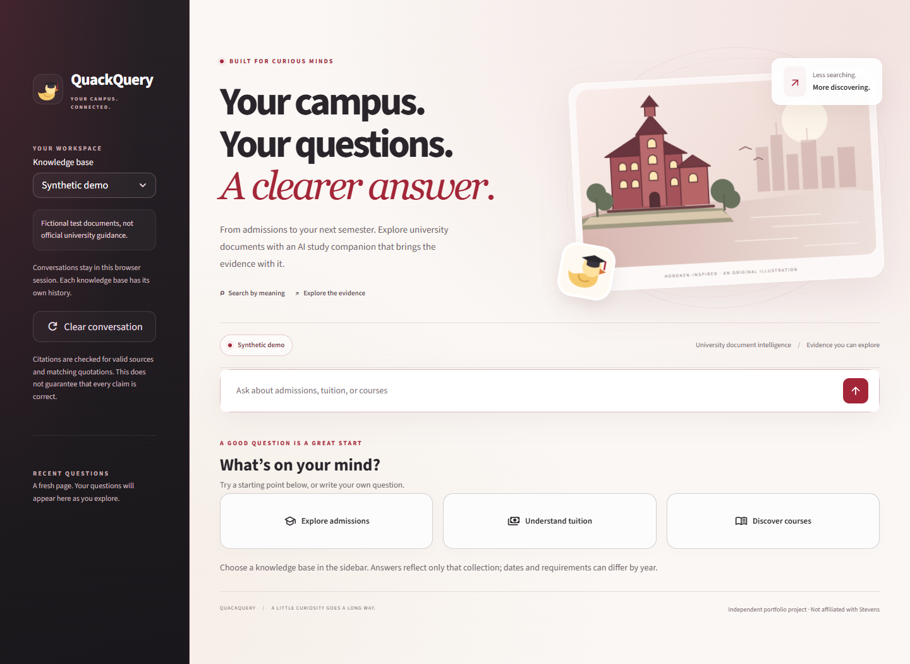

# QuackQuery

**Your campus. Your questions. A clearer answer.**

QuackQuery is a Stevens-inspired AI document assistant that helps students explore admissions, tuition, courses, and university policies. Ask a question in plain language and inspect the source passages behind the answer.

**[Try the live app](https://quackquery-seven.vercel.app)** | [Architecture](docs/architecture.md) | [Evaluation results](docs/results.md) | [Vercel deployment](docs/vercel.md)



An independent portfolio project, not affiliated with Stevens Institute of Technology. The campus and duck illustrations are original graphics.

## Why QuackQuery exists

University information is spread across long PDFs, Word documents, and policy pages. Finding a requirement can mean searching several files and checking which academic year or program it applies to. QuackQuery brings those documents into a searchable collection and returns answers with passages you can inspect.

The application uses retrieval-augmented generation (RAG): it finds relevant document text first, then asks an AI model to answer from that text. When the collection does not contain an answer, it says so.

## Features

- **Stevens-inspired interface:** crimson accents, a charcoal sidebar, original campus and duck artwork, responsive layouts, and subtle animations with reduced-motion support.
- **Hybrid search:** semantic embeddings find related meanings; BM25 finds exact words, course codes, and other specific terms. Reciprocal-rank fusion (RRF) combines their rankings.
- **Inspectable citations:** expandable source panels show matching quotations, surrounding passages, and document metadata. Original PDF/DOCX files can be downloaded; reviewed summaries link to their official sources.
- **Separate knowledge bases:** synthetic examples, original unverified documents, and reviewed university summaries have separate indexes and conversation histories.
- **Conversation support:** session history, recent questions, follow-up context, and a clear-conversation control.
- **Backend recovery:** startup checks indexes and rebuilds missing or outdated snapshots. Answers have bounded generation retries, provider cooldowns, configurable request limits, and readable error messages.
- **Deployment and evaluation:** a live Vercel container deployment, Docker Compose support, CI, automated tests, and documented retrieval and answer benchmarks.

## Document collections

The deployed snapshot contains **30 documents and 59 chunks**:

| Knowledge base | Documents | Chunks | What it contains |
| --- | ---: | ---: | --- |
| Synthetic demo | 20 | 22 | Fictional DOCX policies for testing the application |
| Original documents (unverified) | 5 | 32 | PDFs whose contents have not been checked against official university sources |
| Reviewed university sources | 5 | 5 | Dated factual summaries checked against official Stevens pages on September 17, 2026 |

Reviewed summaries are selected extracts, not complete university documents or independently verified source copies. Follow the official links for full context. Requirements may differ by program and academic year.

## How it works

1. **Read the documents.** PDF text is extracted page by page with `pypdf`. DOCX files are read using Python's ZIP and XML libraries; paragraphs and table-row text are preserved. Reviewed summaries are loaded from text files.
2. **Create chunks.** Text is grouped by sentences with a target size of 900 characters and up to 150 characters of overlap from complete sentences. These are approximate character limits, not token limits; a long sentence can exceed the target. PDF chunks stay within their source page.
3. **Build the indexes.** `all-MiniLM-L6-v2` produces normalized embeddings stored in Chroma. Each chunk records its document path, filename, content hash, source type, locator, and chunk number, plus available publication and review metadata.
4. **Retrieve relevant passages.** Semantic search and BM25 search run against the selected collection. RRF combines their rankings, and the interactive app supplies up to eight chunks to the answer model.
5. **Generate and check the answer.** Groq returns a structured response using `openai/gpt-oss-20b` by default. The backend checks citation IDs and quotations against the supplied chunks. An invalid response gets one correction attempt; if validation still fails, it is not presented as a verified answer.
6. **Show the evidence.** The UI displays claims with expandable sources. Source downloads require a valid local path and a matching document hash.

Parsing failures or documents with no extracted text stop ingestion before a new index is published, preserving the existing snapshot. DOCX headers and footers are not extracted separately; PDF headers and page numbers may remain in extracted text. Scanned PDFs require OCR, which is not implemented.

Citation validation checks that the quoted text exists in the retrieved source. It does **not** prove that every generated claim logically follows from that text.

## Technology

| Layer | Implementation |
| --- | --- |
| Interface | Streamlit, custom CSS, original inline SVG illustrations |
| Document parsing | `pypdf`, Python `zipfile` and `xml.etree.ElementTree` |
| Embeddings | Sentence Transformers with `all-MiniLM-L6-v2`, PyTorch |
| Vector storage | Chroma |
| Keyword retrieval | BM25 implemented in Python |
| Ranking | Reciprocal-rank fusion with equal contributions from both rankings |
| Answer generation | Groq API with structured responses |
| Hosting | Vercel container runtime; Docker Compose for local hosting |

## Run locally

Use **Python 3.11**. From the project directory on Windows:

```powershell
python -m venv .venv
.\.venv\Scripts\python.exe -m pip install -r requirements.txt
Copy-Item .env.example .env
```

Edit `.env` and replace the placeholder with your Groq API key:

```dotenv
GROQ_API_KEY=your-groq-api-key
GROQ_MODEL=openai/gpt-oss-20b
QUACKQUERY_REQUESTS_PER_MINUTE=30
```

The example file also sets `QUACKQUERY_CORPUS=synthetic`. Remove that line to make all three knowledge bases available in the sidebar, or set it to `unverified` or `verified` to expose only that collection.

Start the app:

```powershell
.\run.ps1
```

Open **http://localhost:8502**. The launcher uses the project virtual environment and checks or builds the exposed indexes automatically. Internet access is needed for Groq and the first embedding-model download; model files are cached in `.cache/`.

For another platform, create a virtual environment, install the same requirements, configure `.env`, and run:

```bash
python -m src.serve --host 127.0.0.1 --port 8502
```

To inspect document extraction without downloading model weights:

```powershell
.\.venv\Scripts\python.exe -m src.ingest --corpus synthetic --dry-run
```

To rebuild a collection after editing its documents:

```powershell
.\.venv\Scripts\python.exe -m src.ingest --corpus verified
```

Synthetic documents must remain in paths containing `synthetic`. When a same-name PDF/DOCX pair exists, ingestion selects the PDF.

## Tests and evaluation

```powershell
.\.venv\Scripts\python.exe -m unittest discover -s tests -v
.\.venv\Scripts\python.exe -m src.evaluate --split test --output eval/test-results.json
.\.venv\Scripts\python.exe -m src.evaluate --split test --answers --output eval/answer-results-paced.json
```

The project includes the original 32-question benchmark and a 75-case expanded regression suite, including 20 official-source cases:

```powershell
.\.venv\Scripts\python.exe -m src.evaluate_expanded --top-k 3 --output eval/expanded-retrieval-results.json
.\.venv\Scripts\python.exe -m src.evaluate_expanded --answers --output eval/expanded-full-answers.json
```

Answer evaluation calls Groq and uses 20-second pacing by default. Retrieval evaluation uses three chunks; the interactive app and expanded answer evaluation use eight. Read the [evaluation protocol](eval/README.md), [results report](docs/results.md), and [expanded benchmark report](eval/EXPANDED.md) for scope and limitations.

On **October 2, 2026**, all **46 local tests** passed. Live Vercel checks verified startup, answers across all three collections, citations, official source links, PDF/DOCX downloads, unsupported-question handling, and mobile layout.

## Deployment

### Vercel

The live application is available at **https://quackquery-seven.vercel.app**.

`Dockerfile.vercel` packages the embedding model and all document indexes. Each running instance copies the built index to writable temporary storage. Configure `PORT=8501` and an encrypted `GROQ_API_KEY` in Vercel's production and preview environment variables, then deploy from a linked project:

```bash
vercel deploy --prod
```

Secrets, local environments, cached credentials, and the local database are excluded from deployment uploads. Git-based automatic deployment is not connected; the current deployment uses the CLI. See the [Vercel guide](docs/vercel.md) for configuration and verification details.

### Docker Compose

```powershell
docker compose up --build -d
```

Compose requires `.env`, exposes **http://localhost:8501**, and persists the document index in a named volume. See the [deployment runbook](docs/deployment-runbook.md).

## Limitations

- This is a portfolio document assistant, not an official university advising service. The small evaluation collections do not establish real-world factual accuracy.
- Citation checks verify source IDs and matching quotations, not complete factual correctness. Conflict reasoning is model-based; follow-up references use a simple heuristic.
- OCR, cross-encoder reranking, user accounts, and access to private student records are not implemented.
- Conversation history and request limits are per session. Vercel WebSocket reconnections may start a fresh session; there is no shared durable conversation store across instances.
- Hosted document updates require a new deployment. Prior local index snapshots are retained for recovery.
- Groq account limits still apply even when the application's per-session limit has not been reached.

## License

Released under the [MIT License](LICENSE).
