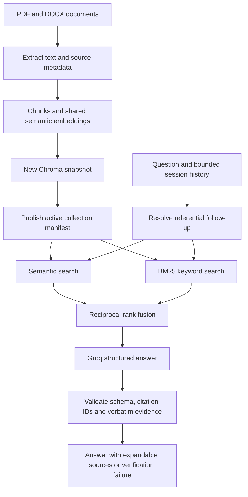

# QuackQuery architecture

The default model is `openai/gpt-oss-20b` through Groq, configurable with
`GROQ_MODEL`. The old Llama model returned a model-not-found response for the
configured account. Groq's current model list is available at
https://console.groq.com/docs/models.

Synthetic and original/unverified documents use separate collections. Lexical
indexes are cached by immutable collection name, so publication of a new
snapshot invalidates the lookup naturally. BM25 scans the small corpus in memory;
this design is intentionally scoped to the portfolio corpus, not millions of documents.
RRF uses equal weights and a rank constant of 60; there is no cross-encoder reranker.

Conversation history lives in Streamlit session state, separated by corpus,
with at most ten completed turns retained. Only the last three turns go to the
model. Simple referential follow-ups carry the recent user questions back to the latest
independent question into retrieval;
independent questions do not. This heuristic can miss complex references and
is not a full conversational query-rewriting model.

Citations are validated structurally: every claim needs an in-range source ID
and a quote of at least 12 normalized characters present in the referenced chunk.
Invalid outputs fail closed. Matching quotations do not prove semantic entailment
or guarantee factual correctness. The source panel supports inspecting the
quoted passage, surrounding chunk, metadata, and original document download.

Ingestion publishes by atomic manifest replacement only after all embeddings
and upserts succeed. Old snapshots are retained. Ingestion is single-writer;
multiple replicas and concurrent ingestion are outside the supported scope.

Strict provider schemas for the default model follow [Groq structured-output documentation](https://console.groq.com/docs/structured-outputs). Local quotation validation runs independently.
